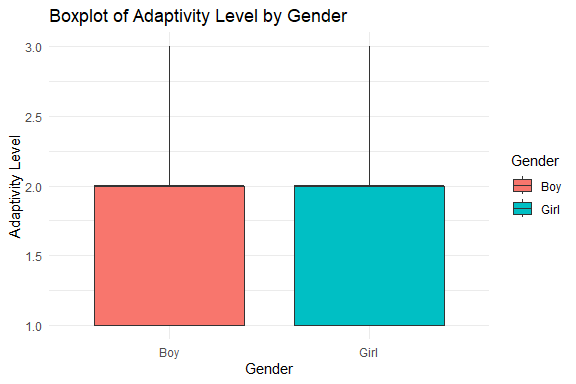

Student Adaptability Level Prediction
================
Trevor Okinda
2024

- [Student Details](#student-details)
- [Setup Chunk](#setup-chunk)
  - [Source:](#source)
  - [Reference:](#reference)
- [Understanding the Dataset (Exploratory Data Analysis
  (EDA))](#understanding-the-dataset-exploratory-data-analysis-eda)
  - [Loading the Dataset](#loading-the-dataset)
  - [Measures of Frequency](#measures-of-frequency)
  - [Measures of Central Tendency](#measures-of-central-tendency)
  - [Measures of Distribution](#measures-of-distribution)
  - [Measures of Relationship](#measures-of-relationship)
  - [Plots](#plots)
- [Preprocessing and Data
  Transformation](#preprocessing-and-data-transformation)
  - [Missing Values](#missing-values)
- [Training Model](#training-model)
  - [Data Splitting](#data-splitting)
  - [Bootstrapping](#bootstrapping)
  - [Cross-validation](#cross-validation)
  - [Training Different Models](#training-different-models)
  - [Model Performance Comparison using
    resamples](#model-performance-comparison-using-resamples)
  - [Saving Model](#saving-model)

# Student Details

|                       |                                       |
|-----------------------|---------------------------------------|
| **Student ID Number** | 134780                                |
| **Student Name**      | Trevor Okinda                         |
| **BBIT 4.2 Group**    | C                                     |
| **Project Name**      | Student Adaptability Level Prediction |

# Setup Chunk

**Note:** the following KnitR options have been set as the global
defaults: <BR>
`knitr::opts_chunk$set(echo = TRUE, warning = FALSE, eval = TRUE, collapse = FALSE, tidy = TRUE)`.

More KnitR options are documented here
<https://bookdown.org/yihui/rmarkdown-cookbook/chunk-options.html> and
here <https://yihui.org/knitr/options/>.

### Source:

The dataset that was used can be downloaded here: *\<<a
href="https://www.kaggle.com/datasets/mdmahmudulhasansuzan/students-adaptability-level-in-online-education\"
class="uri">https://www.kaggle.com/datasets/mdmahmudulhasansuzan/students-adaptability-level-in-online-education\</a>\>*

### Reference:

*\<Md. Mahmudul Hasan Suzan. (n.d.). Students’ Adaptability Level in
Online Education \[Data set\]. Kaggle. <a
href="https://www.kaggle.com/datasets/mdmahmudulhasansuzan/students-adaptability-level-in-online-education\"
class="uri">https://www.kaggle.com/datasets/mdmahmudulhasansuzan/students-adaptability-level-in-online-education\</a>\>  
Refer to the APA 7th edition manual for rules on how to cite datasets:
<https://apastyle.apa.org/style-grammar-guidelines/references/examples/data-set-references>*

# Understanding the Dataset (Exploratory Data Analysis (EDA))

## Loading the Dataset

``` r
# Load the dataset
EducationData <- read.csv("students_adaptability_level_online_education.csv", colClasses = c(
  Gender = "factor",
  Education_Level = "factor",
  Institution_Type = "factor",
  IT_Student = "factor",
  Location = "factor",
  Load_shedding = "factor",
  Financial_Condition = "factor",
  Internet_Type = "factor",
  Network_Type = "factor",
  Self_Lms = "factor",
  Device = "factor",
  Adaptivity_Level = "factor"
))

# Display structure to verify data types
str(EducationData)
```

    ## 'data.frame':    1205 obs. of  12 variables:
    ##  $ Gender             : Factor w/ 2 levels "Boy","Girl": 1 2 2 2 2 1 1 1 1 1 ...
    ##  $ Education_Level    : Factor w/ 3 levels "College","School",..: 3 3 1 2 2 2 2 2 1 2 ...
    ##  $ Institution_Type   : Factor w/ 2 levels "Government","Non Government": 2 2 1 2 2 2 2 2 1 2 ...
    ##  $ IT_Student         : Factor w/ 2 levels "No","Yes": 1 1 1 1 1 1 1 1 1 1 ...
    ##  $ Location           : Factor w/ 2 levels "No","Yes": 2 2 2 2 2 2 2 2 2 2 ...
    ##  $ Load_shedding      : Factor w/ 2 levels "High","Low": 2 1 2 2 2 2 2 2 2 2 ...
    ##  $ Financial_Condition: Factor w/ 3 levels "Mid","Poor","Rich": 1 1 1 1 2 2 1 1 1 1 ...
    ##  $ Internet_Type      : Factor w/ 2 levels "Mobile Data",..: 2 1 2 1 1 1 2 2 2 1 ...
    ##  $ Network_Type       : Factor w/ 3 levels "2G","3G","4G": 3 3 3 3 2 2 3 3 3 2 ...
    ##  $ Self_Lms           : Factor w/ 2 levels "No","Yes": 1 2 1 1 1 1 1 1 1 1 ...
    ##  $ Device             : Factor w/ 3 levels "Computer","Mobile",..: 3 2 2 2 2 2 2 2 2 2 ...
    ##  $ Adaptivity_Level   : Factor w/ 3 levels "High","Low","Moderate": 3 3 3 3 2 2 2 3 2 3 ...

``` r
# Display first few rows to ensure data is loaded correctly
head(EducationData)
```

    ##   Gender Education_Level Institution_Type IT_Student Location Load_shedding
    ## 1    Boy      University   Non Government         No      Yes           Low
    ## 2   Girl      University   Non Government         No      Yes          High
    ## 3   Girl         College       Government         No      Yes           Low
    ## 4   Girl          School   Non Government         No      Yes           Low
    ## 5   Girl          School   Non Government         No      Yes           Low
    ## 6    Boy          School   Non Government         No      Yes           Low
    ##   Financial_Condition Internet_Type Network_Type Self_Lms Device
    ## 1                 Mid          Wifi           4G       No    Tab
    ## 2                 Mid   Mobile Data           4G      Yes Mobile
    ## 3                 Mid          Wifi           4G       No Mobile
    ## 4                 Mid   Mobile Data           4G       No Mobile
    ## 5                Poor   Mobile Data           3G       No Mobile
    ## 6                Poor   Mobile Data           3G       No Mobile
    ##   Adaptivity_Level
    ## 1         Moderate
    ## 2         Moderate
    ## 3         Moderate
    ## 4         Moderate
    ## 5              Low
    ## 6              Low

``` r
# View the dataset in a spreadsheet-like interface (optional)
View(EducationData)
```

## Measures of Frequency

``` r
# Load required libraries
library(DescTools)  # For Mode function

# 1. Measures of Frequency
gender_frequency <- table(EducationData$Gender)
education_level_frequency <- table(EducationData$Education_Level)

print("Frequency Tables:")
```

    ## [1] "Frequency Tables:"

``` r
print(gender_frequency)
```

    ## 
    ##  Boy Girl 
    ##  663  542

``` r
print(education_level_frequency)
```

    ## 
    ##    College     School University 
    ##        219        530        456

``` r
# Relative frequency
gender_relative_freq <- prop.table(gender_frequency)
education_level_relative_freq <- prop.table(education_level_frequency)

print("Relative Frequencies:")
```

    ## [1] "Relative Frequencies:"

``` r
print(gender_relative_freq)
```

    ## 
    ##       Boy      Girl 
    ## 0.5502075 0.4497925

``` r
print(education_level_relative_freq)
```

    ## 
    ##    College     School University 
    ##  0.1817427  0.4398340  0.3784232

## Measures of Central Tendency

``` r
# 2. Measures of Central Tendency
# Recode Adaptivity_Level to numeric for numerical operations
EducationData$Adaptivity_Level <- as.numeric(factor(EducationData$Adaptivity_Level, 
                                                    levels = c("Low", "Moderate", "High")))

mean_adaptivity <- mean(EducationData$Adaptivity_Level, na.rm = TRUE)
median_adaptivity <- median(EducationData$Adaptivity_Level, na.rm = TRUE)
mode_adaptivity <- Mode(EducationData$Adaptivity_Level, na.rm = TRUE)

print(paste("Mean Adaptivity Level:", mean_adaptivity))
```

    ## [1] "Mean Adaptivity Level: 1.68464730290456"

``` r
print(paste("Median Adaptivity Level:", median_adaptivity))
```

    ## [1] "Median Adaptivity Level: 2"

``` r
print(paste("Mode Adaptivity Level:", mode_adaptivity))
```

    ## [1] "Mode Adaptivity Level: 2"

## Measures of Distribution

``` r
# 3. Measures of Distribution
range_adaptivity <- range(EducationData$Adaptivity_Level, na.rm = TRUE)
variance_adaptivity <- var(EducationData$Adaptivity_Level, na.rm = TRUE)
sd_adaptivity <- sd(EducationData$Adaptivity_Level, na.rm = TRUE)
quantiles_adaptivity <- quantile(EducationData$Adaptivity_Level, na.rm = TRUE)

print(paste("Range:", range_adaptivity[1], "to", range_adaptivity[2]))
```

    ## [1] "Range: 1 to 3"

``` r
print(paste("Variance:", variance_adaptivity))
```

    ## [1] "Variance: 0.382197653740643"

``` r
print(paste("Standard Deviation:", sd_adaptivity))
```

    ## [1] "Standard Deviation: 0.618221363057476"

``` r
print("Quantiles:")
```

    ## [1] "Quantiles:"

``` r
print(quantiles_adaptivity)
```

    ##   0%  25%  50%  75% 100% 
    ##    1    1    2    2    3

## Measures of Relationship

``` r
# 4. Measures of Relationship
# Correlation (numerical relationship)
correlation <- cor(as.numeric(EducationData$Financial_Condition), 
                   EducationData$Adaptivity_Level, 
                   use = "complete.obs")

print(paste("Correlation between Financial Condition and Adaptivity Level:", correlation))
```

    ## [1] "Correlation between Financial Condition and Adaptivity Level: 0.192931849874346"

``` r
# Contingency table (categorical relationship)
contingency_table <- table(EducationData$Gender, EducationData$Device)
print("Contingency Table:")
```

    ## [1] "Contingency Table:"

``` r
print(contingency_table)
```

    ##       
    ##        Computer Mobile Tab
    ##   Boy       124    520  19
    ##   Girl       38    493  11

``` r
# Chi-squared test for independence
chi_sq_test <- chisq.test(contingency_table)
print("Chi-squared Test Result:")
```

    ## [1] "Chi-squared Test Result:"

``` r
print(chi_sq_test)
```

    ## 
    ##  Pearson's Chi-squared test
    ## 
    ## data:  contingency_table
    ## X-squared = 36.727, df = 2, p-value = 1.059e-08

## Plots

``` r
# Load required libraries
library(ggplot2)

# 1. Univariate Plots
# Histogram for a numerical variable (Adaptivity_Level)
ggplot(EducationData, aes(x = Adaptivity_Level)) +
  geom_histogram(binwidth = 0.5, fill = "blue", color = "black") +
  labs(title = "Histogram of Adaptivity Level", x = "Adaptivity Level", y = "Count") +
  theme_minimal()
```

<!-- -->

``` r
# Bar plot for a categorical variable (Gender)
ggplot(EducationData, aes(x = Gender)) +
  geom_bar(fill = "green", color = "black") +
  labs(title = "Bar Plot of Gender", x = "Gender", y = "Count") +
  theme_minimal()
```

<!-- -->

``` r
# Boxplot for a numerical variable (Adaptivity_Level by Gender)
ggplot(EducationData, aes(x = Gender, y = Adaptivity_Level, fill = Gender)) +
  geom_boxplot() +
  labs(title = "Boxplot of Adaptivity Level by Gender", x = "Gender", y = "Adaptivity Level") +
  theme_minimal()
```

<!-- -->

``` r
# 2. Multivariate Plots
# Scatter plot (Financial Condition vs. Adaptivity Level)
ggplot(EducationData, aes(x = as.numeric(Financial_Condition), y = Adaptivity_Level)) +
  geom_point(color = "blue", alpha = 0.7) +
  geom_smooth(method = "lm", color = "red", se = FALSE) +
  labs(title = "Scatter Plot of Financial Condition vs. Adaptivity Level", 
       x = "Financial Condition", y = "Adaptivity Level") +
  theme_minimal()
```

    ## `geom_smooth()` using formula = 'y ~ x'

<!-- -->

``` r
# Stacked bar plot (Gender and Device)
ggplot(EducationData, aes(x = Gender, fill = Device)) +
  geom_bar(position = "stack") +
  labs(title = "Stacked Bar Plot of Gender and Device", x = "Gender", y = "Count") +
  theme_minimal()
```

<!-- -->

``` r
# Faceted plot (Adaptivity Level by Internet Type)
ggplot(EducationData, aes(x = Internet_Type, y = Adaptivity_Level, fill = Internet_Type)) +
  geom_boxplot() +
  facet_wrap(~ Gender) +
  labs(title = "Boxplot of Adaptivity Level by Internet Type (Faceted by Gender)",
       x = "Internet Type", y = "Adaptivity Level") +
  theme_minimal()
```

<!-- -->

# Preprocessing and Data Transformation

## Missing Values

``` r
# Check for missing values in the dataset
missing_values_summary <- colSums(is.na(EducationData))

# Display the summary of missing values per column
print("Summary of Missing Values:")
```

    ## [1] "Summary of Missing Values:"

``` r
print(missing_values_summary)
```

    ##              Gender     Education_Level    Institution_Type          IT_Student 
    ##                   0                   0                   0                   0 
    ##            Location       Load_shedding Financial_Condition       Internet_Type 
    ##                   0                   0                   0                   0 
    ##        Network_Type            Self_Lms              Device    Adaptivity_Level 
    ##                   0                   0                   0                   0

``` r
# Check if the dataset contains any missing values
any_missing <- any(is.na(EducationData))

if (any_missing) {
  print("The dataset contains missing values.")
} else {
  print("The dataset has no missing values.")
}
```

    ## [1] "The dataset has no missing values."

# Training Model

## Data Splitting

``` r
# Load required libraries
library(caret)  # For cross-validation and data splitting
```

    ## Loading required package: lattice

    ## 
    ## Attaching package: 'caret'

    ## The following objects are masked from 'package:DescTools':
    ## 
    ##     MAE, RMSE

``` r
library(boot)   # For bootstrapping
```

    ## 
    ## Attaching package: 'boot'

    ## The following object is masked from 'package:lattice':
    ## 
    ##     melanoma

``` r
# Load dataset
set.seed(123)  # Set seed for reproducibility

# 1. Data Splitting
# Split data into training (70%) and testing (30%) sets
train_index <- createDataPartition(EducationData$Adaptivity_Level, p = 0.7, list = FALSE)
train_data <- EducationData[train_index, ]
test_data <- EducationData[-train_index, ]

print("Training and Testing Data Summary:")
```

    ## [1] "Training and Testing Data Summary:"

``` r
print(paste("Training Data Rows:", nrow(train_data)))
```

    ## [1] "Training Data Rows: 844"

``` r
print(paste("Testing Data Rows:", nrow(test_data)))
```

    ## [1] "Testing Data Rows: 361"

## Bootstrapping

``` r
# 2. Bootstrapping
# Define a function to calculate a statistic (e.g., mean of Adaptivity_Level)
bootstrap_function <- function(data, indices) {
  d <- data[indices, ]  # Resample with replacement
  return(mean(d$Adaptivity_Level, na.rm = TRUE))
}

# Apply bootstrapping with 1000 resamples
bootstrap_results <- boot(data = train_data, statistic = bootstrap_function, R = 1000)

print("Bootstrapping Results:")
```

    ## [1] "Bootstrapping Results:"

``` r
print(bootstrap_results)
```

    ## 
    ## ORDINARY NONPARAMETRIC BOOTSTRAP
    ## 
    ## 
    ## Call:
    ## boot(data = train_data, statistic = bootstrap_function, R = 1000)
    ## 
    ## 
    ## Bootstrap Statistics :
    ##     original        bias    std. error
    ## t1* 1.683649 -0.0001291469  0.02185855

## Cross-validation

``` r
# 3. Cross-validation
# Basic k-fold cross-validation (k = 10)
cv_control <- trainControl(method = "cv", number = 10)
cv_model <- train(Adaptivity_Level ~ ., data = train_data, method = "lm", trControl = cv_control)

print("Basic Cross-validation Results:")
```

    ## [1] "Basic Cross-validation Results:"

``` r
print(cv_model)
```

    ## Linear Regression 
    ## 
    ## 844 samples
    ##  11 predictor
    ## 
    ## No pre-processing
    ## Resampling: Cross-Validated (10 fold) 
    ## Summary of sample sizes: 760, 760, 759, 760, 760, 760, ... 
    ## Resampling results:
    ## 
    ##   RMSE       Rsquared   MAE      
    ##   0.5423214  0.2379585  0.4440782
    ## 
    ## Tuning parameter 'intercept' was held constant at a value of TRUE

``` r
# Repeated k-fold cross-validation (k = 10, repeated 5 times)
repeated_cv_control <- trainControl(method = "repeatedcv", number = 10, repeats = 5)
repeated_cv_model <- train(Adaptivity_Level ~ ., data = train_data, method = "lm", trControl = repeated_cv_control)

print("Repeated Cross-validation Results:")
```

    ## [1] "Repeated Cross-validation Results:"

``` r
print(repeated_cv_model)
```

    ## Linear Regression 
    ## 
    ## 844 samples
    ##  11 predictor
    ## 
    ## No pre-processing
    ## Resampling: Cross-Validated (10 fold, repeated 5 times) 
    ## Summary of sample sizes: 760, 759, 759, 760, 760, 759, ... 
    ## Resampling results:
    ## 
    ##   RMSE       Rsquared   MAE     
    ##   0.5415321  0.2411522  0.443538
    ## 
    ## Tuning parameter 'intercept' was held constant at a value of TRUE

``` r
# Leave-One-Out Cross-Validation (LOOCV)
loocv_control <- trainControl(method = "LOOCV")
loocv_model <- train(Adaptivity_Level ~ ., data = train_data, method = "lm", trControl = loocv_control)

print("LOOCV Results:")
```

    ## [1] "LOOCV Results:"

``` r
print(loocv_model)
```

    ## Linear Regression 
    ## 
    ## 844 samples
    ##  11 predictor
    ## 
    ## No pre-processing
    ## Resampling: Leave-One-Out Cross-Validation 
    ## Summary of sample sizes: 843, 843, 843, 843, 843, 843, ... 
    ## Resampling results:
    ## 
    ##   RMSE       Rsquared   MAE      
    ##   0.5421943  0.2316512  0.4433011
    ## 
    ## Tuning parameter 'intercept' was held constant at a value of TRUE

## Training Different Models

``` r
# Load required libraries
library(caret)       # For data splitting and model training
library(rpart)       # For Decision Tree
library(randomForest) # For Random Forest
```

    ## randomForest 4.7-1.1

    ## Type rfNews() to see new features/changes/bug fixes.

    ## 
    ## Attaching package: 'randomForest'

    ## The following object is masked from 'package:ggplot2':
    ## 
    ##     margin

``` r
# Set seed for reproducibility
set.seed(123)

# Split data into training and testing sets (70-30 split)
train_index <- createDataPartition(EducationData$Adaptivity_Level, p = 0.7, list = FALSE)
train_data <- EducationData[train_index, ]
test_data <- EducationData[-train_index, ]

# 1. Linear Regression
linear_model <- train(
  Adaptivity_Level ~ ., 
  data = train_data, 
  method = "lm",
  trControl = trainControl(method = "cv", number = 10)  # 10-fold CV
)

print("Linear Regression Model:")
```

    ## [1] "Linear Regression Model:"

``` r
print(linear_model)
```

    ## Linear Regression 
    ## 
    ## 844 samples
    ##  11 predictor
    ## 
    ## No pre-processing
    ## Resampling: Cross-Validated (10 fold) 
    ## Summary of sample sizes: 759, 759, 760, 759, 759, 760, ... 
    ## Resampling results:
    ## 
    ##   RMSE       Rsquared   MAE      
    ##   0.5416332  0.2437092  0.4445259
    ## 
    ## Tuning parameter 'intercept' was held constant at a value of TRUE

``` r
# 2. Decision Tree Regression
tree_model <- train(
  Adaptivity_Level ~ ., 
  data = train_data, 
  method = "rpart",
  trControl = trainControl(method = "cv", number = 10)  # 10-fold CV
)

print("Decision Tree Regression Model:")
```

    ## [1] "Decision Tree Regression Model:"

``` r
print(tree_model)
```

    ## CART 
    ## 
    ## 844 samples
    ##  11 predictor
    ## 
    ## No pre-processing
    ## Resampling: Cross-Validated (10 fold) 
    ## Summary of sample sizes: 759, 759, 760, 760, 760, 760, ... 
    ## Resampling results across tuning parameters:
    ## 
    ##   cp          RMSE       Rsquared    MAE      
    ##   0.03105313  0.5638239  0.18613737  0.4827276
    ##   0.07150864  0.5843704  0.12935108  0.5204732
    ##   0.09393685  0.6126035  0.04946294  0.5487507
    ## 
    ## RMSE was used to select the optimal model using the smallest value.
    ## The final value used for the model was cp = 0.03105313.

``` r
# 3. Random Forest Regression
rf_model <- train(
  Adaptivity_Level ~ ., 
  data = train_data, 
  method = "rf",
  trControl = trainControl(method = "cv", number = 10),  # 10-fold CV
  tuneLength = 5  # Test 5 different values of mtry
)

print("Random Forest Regression Model:")
```

    ## [1] "Random Forest Regression Model:"

``` r
print(rf_model)
```

    ## Random Forest 
    ## 
    ## 844 samples
    ##  11 predictor
    ## 
    ## No pre-processing
    ## Resampling: Cross-Validated (10 fold) 
    ## Summary of sample sizes: 760, 760, 760, 760, 760, 759, ... 
    ## Resampling results across tuning parameters:
    ## 
    ##   mtry  RMSE       Rsquared   MAE      
    ##    2    0.4814349  0.4670536  0.4031121
    ##    5    0.4105101  0.5692939  0.3016504
    ##    8    0.4008840  0.5819596  0.2800309
    ##   11    0.3991553  0.5846844  0.2722665
    ##   15    0.3999780  0.5830711  0.2677734
    ## 
    ## RMSE was used to select the optimal model using the smallest value.
    ## The final value used for the model was mtry = 11.

``` r
# Evaluate all models on the test data
linear_predictions <- predict(linear_model, newdata = test_data)
tree_predictions <- predict(tree_model, newdata = test_data)
rf_predictions <- predict(rf_model, newdata = test_data)

# Calculate performance metrics for all models
linear_rmse <- RMSE(linear_predictions, test_data$Adaptivity_Level)
tree_rmse <- RMSE(tree_predictions, test_data$Adaptivity_Level)
rf_rmse <- RMSE(rf_predictions, test_data$Adaptivity_Level)

print(paste("Linear Regression RMSE:", linear_rmse))
```

    ## [1] "Linear Regression RMSE: 0.535891636864365"

``` r
print(paste("Decision Tree RMSE:", tree_rmse))
```

    ## [1] "Decision Tree RMSE: 0.562703437143847"

``` r
print(paste("Random Forest RMSE:", rf_rmse))
```

    ## [1] "Random Forest RMSE: 0.403037399300005"

## Model Performance Comparison using resamples

``` r
# Compare model performance using resamples
models <- list(
  Linear_Regression = linear_model,
  Decision_Tree = tree_model,
  Random_Forest = rf_model
)

# Resample models to compare performance
resample_results <- resamples(models)

# Summary of resampling results
summary(resample_results)
```

    ## 
    ## Call:
    ## summary.resamples(object = resample_results)
    ## 
    ## Models: Linear_Regression, Decision_Tree, Random_Forest 
    ## Number of resamples: 10 
    ## 
    ## MAE 
    ##                        Min.   1st Qu.    Median      Mean   3rd Qu.      Max.
    ## Linear_Regression 0.4055381 0.4299136 0.4429175 0.4445259 0.4559747 0.4827950
    ## Decision_Tree     0.4497568 0.4638551 0.4744060 0.4827276 0.4920496 0.5631803
    ## Random_Forest     0.2284490 0.2488010 0.2724453 0.2722665 0.2966149 0.3216227
    ##                   NA's
    ## Linear_Regression    0
    ## Decision_Tree        0
    ## Random_Forest        0
    ## 
    ## RMSE 
    ##                        Min.   1st Qu.    Median      Mean   3rd Qu.      Max.
    ## Linear_Regression 0.5022575 0.5237913 0.5335159 0.5416332 0.5544397 0.6006220
    ## Decision_Tree     0.5050720 0.5338756 0.5614361 0.5638239 0.5726282 0.6663587
    ## Random_Forest     0.3360259 0.3624874 0.3970053 0.3991553 0.4229333 0.4855610
    ##                   NA's
    ## Linear_Regression    0
    ## Decision_Tree        0
    ## Random_Forest        0
    ## 
    ## Rsquared 
    ##                         Min.   1st Qu.    Median      Mean   3rd Qu.      Max.
    ## Linear_Regression 0.08221650 0.1975629 0.2632460 0.2437092 0.2849365 0.3463346
    ## Decision_Tree     0.02603314 0.1238416 0.1665992 0.1861374 0.2444439 0.3700484
    ## Random_Forest     0.41477043 0.5446083 0.5870319 0.5846844 0.6483737 0.7155093
    ##                   NA's
    ## Linear_Regression    0
    ## Decision_Tree        0
    ## Random_Forest        0

``` r
# Boxplot for performance metrics
bwplot(resample_results, layout = c(3, 1))
```

<!-- -->

``` r
# Dot plot for performance metrics
dotplot(resample_results, layout = c(3, 1))
```

<!-- -->

``` r
# Pairwise comparison of model performance (optional)
model_diff <- diff(resample_results)
summary(model_diff)
```

    ## 
    ## Call:
    ## summary.diff.resamples(object = model_diff)
    ## 
    ## p-value adjustment: bonferroni 
    ## Upper diagonal: estimates of the difference
    ## Lower diagonal: p-value for H0: difference = 0
    ## 
    ## MAE 
    ##                   Linear_Regression Decision_Tree Random_Forest
    ## Linear_Regression                   -0.0382        0.1723      
    ## Decision_Tree     0.1469                           0.2105      
    ## Random_Forest     4.056e-06         1.678e-07                  
    ## 
    ## RMSE 
    ##                   Linear_Regression Decision_Tree Random_Forest
    ## Linear_Regression                   -0.02219       0.14248     
    ## Decision_Tree     0.9972414                        0.16467     
    ## Random_Forest     8.072e-05         0.0001181                  
    ## 
    ## Rsquared 
    ##                   Linear_Regression Decision_Tree Random_Forest
    ## Linear_Regression                    0.05757      -0.34098     
    ## Decision_Tree     0.8358                          -0.39855     
    ## Random_Forest     2.075e-05         1.418e-05

## Saving Model

``` r
# Saving the model
saveRDS(rf_model, "./models/saved_rf_model.rds")

# Load the saved model
loaded_rf_model <- readRDS("./models/saved_rf_model.rds")

# Example data for predictions
new_data <- data.frame(
  Gender = "Boy", 
  Education_Level = "University", 
  Institution_Type = "Non Government", 
  IT_Student = "No", 
  Location = "Yes", 
  Load_shedding = "Low", 
  Financial_Condition = "Mid", 
  Internet_Type = "Wifi", 
  Network_Type = "4G", 
  Self_Lms = "No", 
  Device = "Tab", 
  Adaptivity_Level = "Moderate"
)

# Use the loaded model to make predictions
predictions_loaded_model <- predict(loaded_rf_model, newdata = new_data)

# Print predictions
print(predictions_loaded_model)
```

    ##        1 
    ## 1.999556

``` r
prediction_numeric <- predict(loaded_rf_model, newdata = new_data)

# Map numeric prediction to factor levels
prediction_factor <- ifelse(prediction_numeric <= 1.5, "Low", 
                            ifelse(prediction_numeric <= 2.5, "Moderate", "High"))

# Print the prediction as a factor
print(prediction_factor)
```

    ##          1 
    ## "Moderate"
